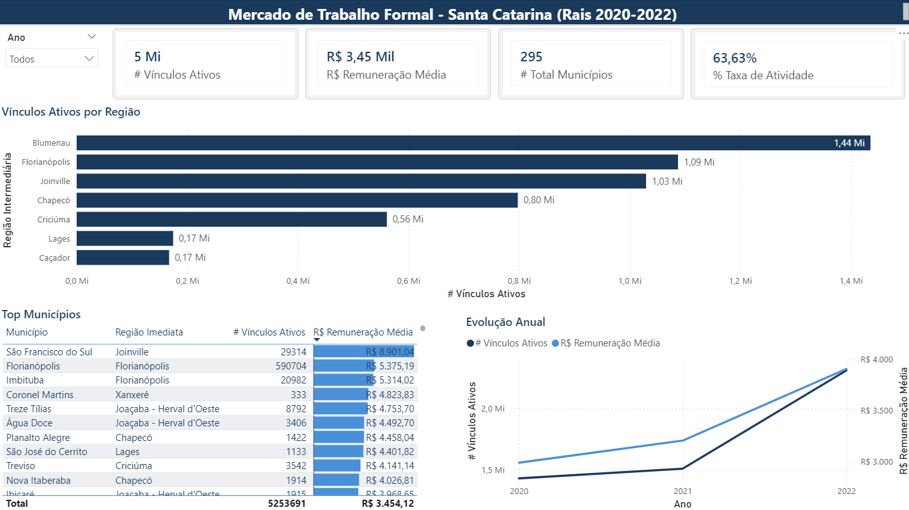
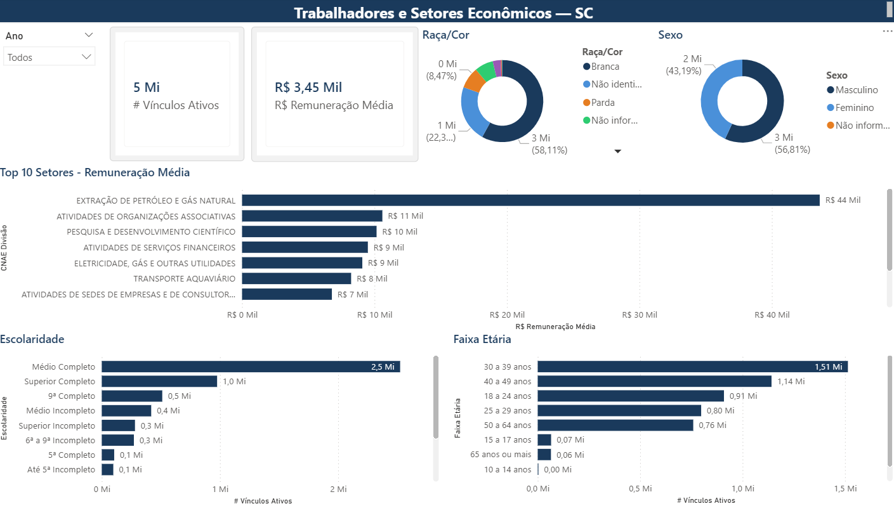
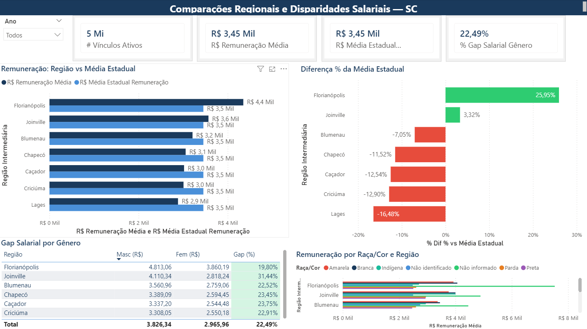
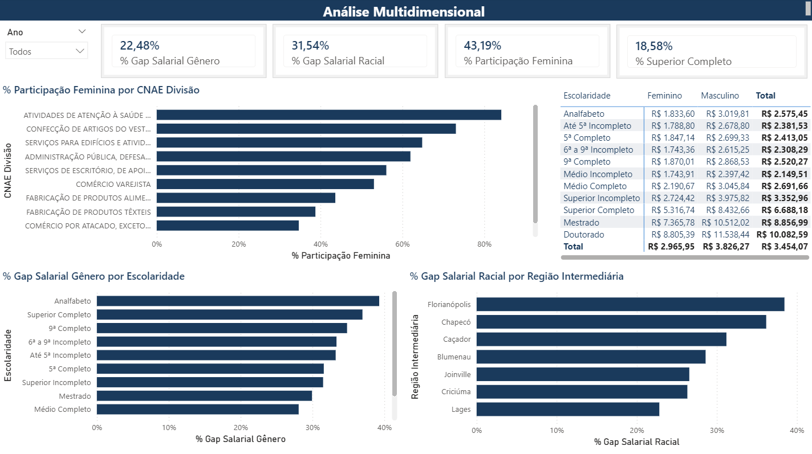

# RAIS Dashboard — Santa Catarina Labor Market Analysis

Power BI dashboard analyzing the formal labor market in Santa Catarina (Brazil) using RAIS microdata from 2020 to 2022.

## Dashboard

| | |
|---|---|
|  |  |
|  |  |

> All pages: [Methodology](screenshots/01-metodologia.png) · [Executive Summary](screenshots/02-resumo-executivo.png) · [Overview](screenshots/03-visao-geral.png) · [Sectors & Profile](screenshots/04-setores-perfil.png) · [Regional Comparisons](screenshots/05-comparacoes-regionais.png) · [Multidimensional](screenshots/06-analise-multidimensional.png)

## Key findings

- **Gender wage gap of 22.5%** — Women earn R$ 2,966 vs R$ 3,826 for men. Worst among workers without formal education (38%) and in Joinville (31%)
- **Racial wage gap of 31.5%** — Florianopolis, the highest-paying region, also has the largest racial gap (38%)
- **Post-pandemic growth** — SC added 900K+ formal jobs between 2020 and 2022 (57% growth), with average pay rising from R$ 3,000 to R$ 3,800
- **Regional concentration** — 3 regions (Blumenau, Florianopolis, Joinville) hold 67% of all active employment. Florianopolis pays 26% above the state average; Lages pays 16% below
- **Education premium** — A university degree pays R$ 6,688 vs R$ 2,692 for high school (2.5x). A doctorate pays R$ 10,083

## Data

| Item | Value |
|------|-------|
| Source | RAIS 2020–2022, Ministry of Labor |
| Scope | Santa Catarina — 295 municipalities |
| Records | 8.26M (after removing 1.7% duplicates) |
| Model | Star schema — 1 fact + 6 dimensions |

### Data treatment

- Removed 144,935 exact duplicate rows (1.7%)
- Kept zero-remuneration records (apprentices/interns) — filtered in measures where needed
- Kept extreme values > R$ 100K (official data, < 0.05%)
- Added "Not reported" category for race/color (7.4% of records) for transparency
- Star schema reduced dataset from 2 GB to 397 MB

### Data model

```
                      dim_municipio (295)
                           |
dim_escolaridade (12) --- fato_rais (8.26M) --- dim_cnae (639)
                          /        |        \
           dim_faixa_etaria (9)  dim_sexo (3)  dim_raca (7)
```

## DAX measures

18 measures in a `_Measures` table, organized by display folder:

| Folder | Measures |
|--------|----------|
| Base | # Total Vinculos, # Vinculos Ativos, # Vinculos Inativos, % Taxa de Atividade, # Total Municipios |
| Remuneration | R$ Remuneracao Media, R$ Remuneracao Mediana, R$ Media Estadual |
| Regional Comparison | R$ Dif vs Media Estadual, % Dif vs Media Estadual |
| Gender Disparity | R$ Rem. Media Masc, R$ Rem. Media Fem, % Gap Salarial Genero, % Participacao Feminina |
| Racial Disparity | R$ Rem. Media Branca, R$ Rem. Media Preta, % Gap Salarial Racial |
| Qualification | % Superior Completo |

## Project structure

```
├── RAIS_SC_Dashboard.pbix       # Power BI file
├── pbi_data/                    # Dimension tables (fact table too large for GitHub)
├── scripts/                     # SQL + Python data pipeline
│   ├── prepare_data.sql         # Full SQL pipeline (single file)
│   ├── prepare_data.py          # Python: load and join
│   ├── optimize_for_pbi.py      # Python: star schema split
│   ├── validate_data.py         # Python: quality checks
│   ├── fix_data.py              # Python: corrections
│   └── fix_csv.py               # Python: regional format fix
└── screenshots/
```

> SQL and Python do the same job — two implementations of the same pipeline.

## How to run

1. Clone this repo
2. Open `RAIS_SC_Dashboard.pbix` in Power BI Desktop
3. If prompted, point data source to `pbi_data/`

To rebuild from raw RAIS data, see `scripts/prepare_data.sql`.
